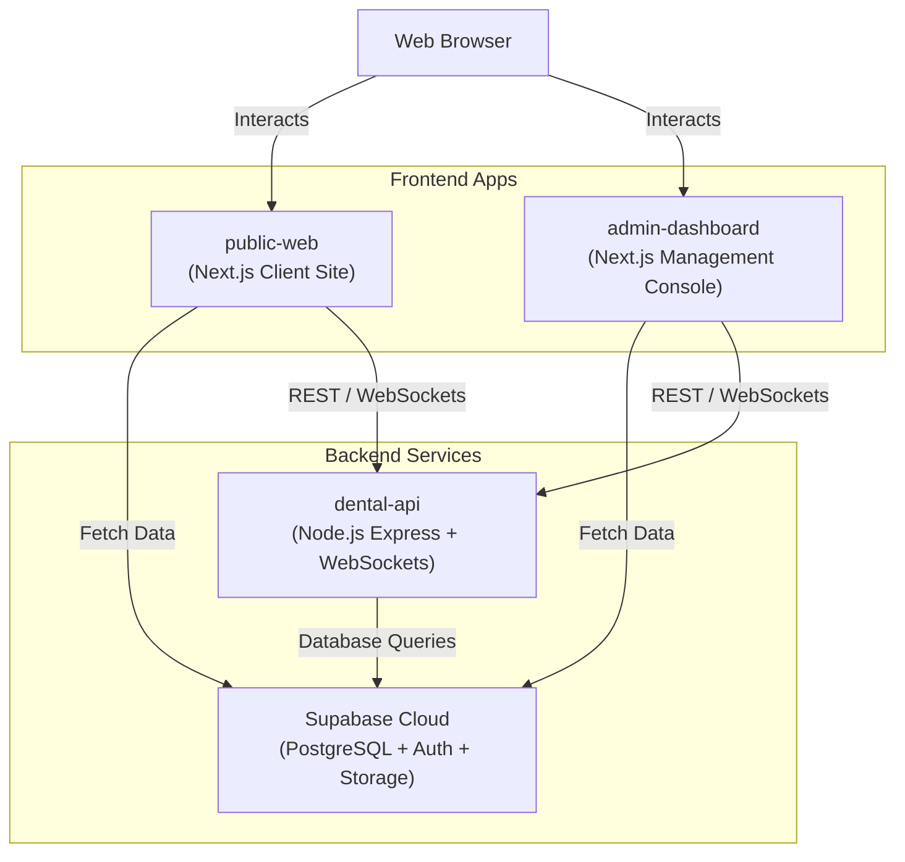

# Project Structure and Hosting Analysis Report

This document outlines the architecture, directory structure, tech stack, and hosting options for the **Dental Portal** monorepo project. You can copy this report to share with other AIs or hosting experts to ask specific setup, migration, or deployment questions.

---

## 1. Monorepo Overview & Architecture

The project is structured as a **monorepo** managed using **Turborepo** and **npm workspaces**. It consists of three primary applications under the `apps/` directory, backed by a **Supabase** backend.

### High-Level Architecture Diagram


---

## 2. Directory Structure

Here is the key layout of the codebase:

```text
Dental-Portal/
├── apps/
│   ├── admin-dashboard/     # Next.js 16 Admin Panel app
│   ├── dental-api/          # Node.js/Express + WebSockets Backend API
│   └── public-web/          # Next.js 16 Customer Facing Website (Cloudflare-ready)
├── supabase/
│   ├── dummy_data.sql       # Initial test records
│   └── migrations/          # PostgreSQL database schema migrations
├── package.json             # Root monorepo configuration (npm workspaces)
├── turbo.json               # Turbopack orchestration file
└── package-lock.json        # Main project lock file
```

---

## 3. Package Configurations & Hosting Needs

### A. Customer Website (`apps/public-web`)
* **Framework:** Next.js 16.2.7 (App Router), React 19
* **Main Tasks:** Client site with service listings, blog posts, appointment bookings.
* **Key Dependencies:** `@opennextjs/cloudflare` (OpenNext), `@supabase/supabase-js`, `framer-motion`, `lucide-react`, TailwindCSS.
* **Hosting Requirements:**
  * Must support Next.js server-side features (ISR, Server Actions, Dynamic API routes).
  * Optimized for **Cloudflare Pages** via OpenNext.
  * **Build Command:** `npm run build:cloudflare` (runs `opennextjs-cloudflare build`)
  * **Output Directory:** `.open-next/assets`

### B. Admin Dashboard (`apps/admin-dashboard`)
* **Framework:** Next.js 16.2.7 (App Router), React 19
* **Main Tasks:** Admin management, inventory management, patient schedule tracking, service/blog updates.
* **Key Dependencies:** `@dnd-kit/core` (drag and drop), `@supabase/supabase-js`, `@tiptap/react` (WYSIWYG editor), TailwindCSS.
* **Hosting Requirements:**
  * Standard SSR/ISR runtime.
  * Can be hosted on **Vercel** (default Next.js host), **Netlify**, or **Cloudflare Pages** (using OpenNext).
  * **Build Command:** `npm run build` (runs `next build`)
  * **Output Directory:** `.next`

### C. Backend API (`apps/dental-api`)
* **Framework:** Node.js Express server with TypeScript (`tsx`)
* **Main Tasks:** WebSocket communication, third-party integrations (SMS via Twilio, Emails via Resend, AI content generation via Google Gemini SDK).
* **Key Dependencies:** `express`, `ws` (WebSockets), `@google/genai` (Gemini API), `twilio`, `resend`, `helmet`, `jsonwebtoken`.
* **Hosting Requirements:**
  * **Crucial:** Needs a **long-running, stateful server runtime** because of WebSockets (`ws`). Serverless runtimes (like Cloudflare Workers/Pages or Vercel Serverless) are **not** suitable for standard Node.js persistent WebSockets.
  * Requires Node.js v20+.
  * **Build Command:** `npm run build` (runs `tsc` compiler)
  * **Start Command:** `npm run start` (runs compiled `node dist/server.js`)

### D. Database (`supabase/`)
* **Database engine:** PostgreSQL
* **Main Tasks:** Schema migrations, user table auth, dental appointments, and content store.
* **Key Migration Files:**
  * `000_full_schema_combined.sql` & `001_initial_schema.sql` (Main tables & triggers)
  * `002_blogs_table.sql`
  * `008_services_table.sql`
* **Hosting Requirements:**
  * Can run directly on **Supabase Cloud** (includes built-in authentication, database triggers, real-time channels, and storage buckets).

---

## 4. Hosting Recommendation Matrix

| Package | Recommended Host | Alternatives | Deployment Model |
| :--- | :--- | :--- | :--- |
| **`public-web`** | **Cloudflare Pages** | Vercel | Serverless / Static + Edge Handlers (OpenNext) |
| **`admin-dashboard`** | **Vercel** | Cloudflare Pages, Netlify | Serverless (Standard Next.js Runtime) |
| **`dental-api`** | **Railway / Render** | DigitalOcean App Platform, VPS (PM2 + Nginx) | Persistent Node.js Docker Container / VPS process |
| **Database** | **Supabase Cloud** | Self-hosted Postgres (AWS RDS) | Managed DBaaS |

---

## 5. Prompt for AI Hosting Assistants

You can use the following prompt to ask other AI assistants (like ChatGPT, Claude, Gemini, etc.) for step-by-step help with setting up your hosting infrastructure.

> **Prompt Template:**
> 
> "I have a dental clinic management monorepo project configured with npm workspaces and Turborepo. I need step-by-step deployment instructions for the following architecture:
> 
> 1. **Client Site (`apps/public-web`)**: Next.js 16 App Router using OpenNext. I want to host this on **Cloudflare Pages**.
> 2. **Admin Panel (`apps/admin-dashboard`)**: Standard Next.js 16 App Router. I want to host this on **Vercel** or **Cloudflare Pages**.
> 3. **Backend REST + WebSocket Server (`apps/dental-api`)**: TypeScript Express API using twilio, resend, websockets (`ws`), and Gemini AI. Since it uses WebSockets, I need to host it on a persistent service like **Railway**, **Render**, or a **VPS**.
> 4. **Database**: PostgreSQL hosted on **Supabase**.
> 
> Can you write a detailed deployment guide showing:
> - How to set up the build settings and env variables for the Cloudflare Pages app?
> - How to build and run the `dental-api` Express app using a Dockerfile or directly on Railway/Render?
> - How to apply the PostgreSQL migrations located in `/supabase/migrations` to my live Supabase database?
> - How to configure CORS settings between the frontend apps (`public-web`/`admin-dashboard`) and the Express backend (`dental-api`)?"

---
